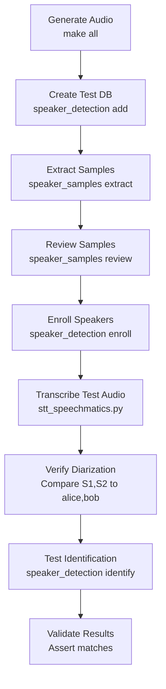

# Testing Infrastructure

This document describes the testing methodology for speaker detection and STT tools. Tests are designed to be reproducible, isolated, and runnable in Docker containers.

## Core Principles

1. **Reproducibility** - Synthetic audio from espeak-ng ensures identical test inputs
2. **Isolation** - Environment variables control all paths; tests don't touch user data
3. **Docker-first** - All tests runnable in containers for CI/CD
4. **End-to-end coverage** - From audio generation to speaker identification

## Test Collections

The speaker-* tool ecosystem uses a unified test runner. Each collection has dedicated documentation.

### Running Tests

```bash
./run_speaker_diarization_tests.sh              # Run all tests
./run_speaker_diarization_tests.sh unit         # Fast unit tests (no API)
./run_speaker_diarization_tests.sh catalog      # Specific collection
./run_speaker_diarization_tests.sh --doc catalog  # View collection docs
```

### Collection Overview

| Collection | Tests | Tool/Module | Documentation |
|------------|-------|-------------|---------------|
| `catalog` | 23 | speaker-catalog | [test_speaker_catalog.README.md](speaker_detection/test_speaker_catalog.README.md) |
| `assign` | 24 | speaker-assign | [test_speaker_assign.README.md](speaker_detection/test_speaker_assign.README.md) |
| `review` | 18 | speaker-review | [test_speaker_review.README.md](speaker_detection/test_speaker_review.README.md) |
| `llm` | 23 | speaker-llm | [test_speaker_llm.README.md](speaker_detection/test_speaker_llm.README.md) |
| `process` | 22 | speaker-process | [test_speaker_process.README.md](speaker_detection/test_speaker_process.README.md) |
| `report` | 26 | speaker-report | [test_speaker_report.README.md](speaker_detection/test_speaker_report.README.md) |
| `segments` | 8 | speaker_segments | [test_speaker_segments.README.md](speaker_detection/test_speaker_segments.README.md) |
| `profiles` | 10 | audio_profiles | [test_audio_profiles.README.md](speaker_detection/test_audio_profiles.README.md) |
| `legacy` | 27 | speaker_detection CLI | [test_legacy.README.md](speaker_detection/test_legacy.README.md) |
| `e2e` | 17 | Pipeline integration | [test_e2e_pipeline.README.md](speaker_detection/test_e2e_pipeline.README.md) |
| `unit` | 181 | All unit tests | [test_unit.README.md](speaker_detection/test_unit.README.md) |
| `all` | 198 | Complete suite | [run_speaker_diarization_tests.sh.README.md](../run_speaker_diarization_tests.sh.README.md) |

### Test Runner Documentation

For complete test runner documentation:

```bash
./run_speaker_diarization_tests.sh --doc all
```

Or see [run_speaker_diarization_tests.sh.README.md](../run_speaker_diarization_tests.sh.README.md).

## Environment Variable Pattern

**Every script MUST check environment variables before using defaults:**

```python
# CORRECT - check env var first
def get_data_dir() -> Path:
    return Path(os.environ.get("SPEAKERS_EMBEDDINGS_DIR",
                               os.path.expanduser("~/.config/speakers_embeddings")))

# INCORRECT - hardcoded path
def get_data_dir() -> Path:
    return Path.home() / ".config" / "speakers_embeddings"  # BAD!
```

**Critical environment variables for testing:**

| Variable | Purpose | Test Value |
|----------|---------|------------|
| `SPEAKERS_EMBEDDINGS_DIR` | Speaker profiles, embeddings, samples | `/tmp/test_speakers_$$` |
| `SPEECHMATICS_API_KEY` | API access (mock in tests) | `test_key_xxx` |
| `SPEAKER_DETECTION_BACKEND` | Which backend to use | `mock` or `speechmatics` |

**Test script pattern:**

```bash
#!/bin/bash
# Always set test-specific directories
export SPEAKERS_EMBEDDINGS_DIR="/tmp/speaker_test_$$"
mkdir -p "$SPEAKERS_EMBEDDINGS_DIR"

# Cleanup on exit
trap "rm -rf $SPEAKERS_EMBEDDINGS_DIR" EXIT

# Run tests...
./speaker_detection list
```

## Test Voice Profiles

We use espeak-ng voices to generate deterministic test audio:

| Profile | espeak-ng Voice | Use Case |
|---------|-----------------|----------|
| `alice` | `en-us` | Primary speaker, enrollment tests |
| `bob` | `en-gb` | Secondary speaker, British accent |
| `charlie` | `en-au` | Third speaker, Australian accent |
| `diana` | `en-sc` | Fourth speaker, Scottish accent |

**Why these voices?**

* Distinct accent patterns aid diarization testing
* English variants ensure STT accuracy
* Four speakers cover typical meeting scenarios

### Voice Generation Commands

```bash
# Single speaker enrollment audio (~10s)
espeak-ng -v en-us -w enroll_alice.wav \
    "Hello, my name is Alice. I am recording this sample for speaker enrollment."

# Check available voices
espeak-ng --voices | grep ^5.*en

# Voice parameters for variation
espeak-ng -v en-us -s 150 -p 50  # speed=150wpm, pitch=50
espeak-ng -v en-us -s 120 -p 70  # slower, higher pitch
```

## Test Audio Generation

### Using the Makefile

```bash
cd evals/speaker_detection

# Generate all test audio
make all

# Just enrollment audio
make enrollment-audio

# Just conversation tests
make test-audio

# List what's configured
make list

# Clean generated files
make clean
```

### Generated Files

```
evals/speaker_detection/audio/
├── enroll_alice.wav      # Enrollment: single speaker
├── enroll_bob.wav
├── enroll_charlie.wav
├── enroll_diana.wav
├── test_001-two-speakers.wav     # Conversation: alice + bob
├── test_002-three-speakers.wav   # Conversation: alice + bob + charlie
└── .gitignore                    # Excludes *.wav, *.ogg, *.mp3
```

### Creating Custom Test Conversations

```bash
# Generate individual segments
espeak-ng -v en-us -w /tmp/seg1.wav "Hello, this is Alice speaking."
espeak-ng -v en-gb -w /tmp/seg2.wav "And this is Bob responding."
espeak-ng -v en-us -w /tmp/seg3.wav "Alice here again."

# Concatenate with ffmpeg
ffmpeg -y \
    -i /tmp/seg1.wav \
    -i /tmp/seg2.wav \
    -i /tmp/seg3.wav \
    -filter_complex "[0][1][2]concat=n=3:v=0:a=1" \
    /tmp/conversation.wav

# Cleanup temp files
rm /tmp/seg*.wav
```

## Test Structure

```
evals/
├── TESTING.md              # This document
├── speaker_detection/
│   ├── Makefile            # Audio generation
│   ├── audio/              # Generated audio (gitignored)
│   │   └── .gitignore
│   ├── samples/            # Reference transcripts
│   ├── test_cli.py         # CLI integration tests
│   ├── benchmark.py        # Performance tests
│   └── test_all.sh         # Run all tests
├── speaker_mapper/
│   └── ...
└── stt/
    └── ...
```

## End-to-End Test Flow



### Example End-to-End Test Script

```bash
#!/bin/bash
set -euo pipefail

# Isolated test directory
export SPEAKERS_EMBEDDINGS_DIR="/tmp/e2e_test_$$"
mkdir -p "$SPEAKERS_EMBEDDINGS_DIR"
trap "rm -rf $SPEAKERS_EMBEDDINGS_DIR" EXIT

cd "$(dirname "$0")"

echo "=== Generating test audio ==="
make -s all

echo "=== Creating speaker profiles ==="
../../speaker_detection add alice --name "Alice" --tag test
../../speaker_detection add bob --name "Bob" --tag test

echo "=== Extracting samples from enrollment ==="
# Assuming we have transcripts for enrollment audio
../../speaker_samples extract audio/enroll_alice.wav \
    -t samples/enroll_alice.json -l S1 -s alice

echo "=== Reviewing samples ==="
../../speaker_samples review alice sample-001 --approve

echo "=== Enrolling speakers ==="
../../speaker_detection enroll alice audio/enroll_alice.wav \
    -t samples/enroll_alice.json -l S1

echo "=== Transcribing test conversation ==="
../../stt_speechmatics.py audio/test_001-two-speakers.wav \
    --speakers-tag test \
    -o /tmp/transcript.json

echo "=== Verifying diarization ==="
# Check that S1 maps to alice, S2 maps to bob
jq '.speakers' /tmp/transcript.json

echo "=== All tests passed ==="
```

## Docker Testing Environment

### Dockerfile for Testing

```dockerfile
# evals/Dockerfile.test
FROM python:3.11-slim

# Install system dependencies
RUN apt-get update && apt-get install -y --no-install-recommends \
    espeak-ng \
    ffmpeg \
    jq \
    make \
    && rm -rf /var/lib/apt/lists/*

# Install b3sum for blake3 hashing
RUN apt-get update && apt-get install -y --no-install-recommends \
    cargo \
    && cargo install b3sum \
    && cp /root/.cargo/bin/b3sum /usr/local/bin/ \
    && apt-get remove -y cargo \
    && rm -rf /root/.cargo \
    && rm -rf /var/lib/apt/lists/*

# Python dependencies
COPY requirements-test.txt /tmp/
RUN pip install --no-cache-dir -r /tmp/requirements-test.txt

# Copy tools
WORKDIR /app
COPY speaker_detection speaker_samples stt_speechmatics.py ./
COPY speaker_detection_backends/ ./speaker_detection_backends/
COPY evals/ ./evals/

# Test-specific environment
ENV SPEAKERS_EMBEDDINGS_DIR=/tmp/test_speakers
ENV SPEAKER_DETECTION_DEBUG=1

# Default command runs all tests
CMD ["bash", "-c", "cd evals/speaker_detection && make all && ./test_all.sh"]
```

### Running Tests in Docker

```bash
# Build test image
docker build -f evals/Dockerfile.test -t speaker-tools-test .

# Run all tests
docker run --rm speaker-tools-test

# Run specific test
docker run --rm speaker-tools-test python evals/speaker_detection/test_cli.py

# Interactive debugging
docker run -it --rm speaker-tools-test bash

# With API key for real backend tests
docker run --rm \
    -e SPEECHMATICS_API_KEY="$SPEECHMATICS_API_KEY" \
    speaker-tools-test
```

### Docker Compose for Full Test Suite

```yaml
# evals/docker-compose.test.yml
version: '3.8'

services:
  test-runner:
    build:
      context: ..
      dockerfile: evals/Dockerfile.test
    environment:
      - SPEAKERS_EMBEDDINGS_DIR=/tmp/test_speakers
      - SPEAKER_DETECTION_DEBUG=1
    volumes:
      - test-data:/tmp/test_speakers

  # Mock Speechmatics API for offline testing
  mock-api:
    image: mockserver/mockserver
    ports:
      - "1080:1080"
    environment:
      - MOCKSERVER_INITIALIZATION_JSON_PATH=/config/expectations.json
    volumes:
      - ./mocks:/config

volumes:
  test-data:
```

## Writing Tests

### Unit Tests (test_cli.py)

```python
#!/usr/bin/env python3
"""Unit tests for speaker_detection CLI."""

import os
import sys
import tempfile
import unittest
from pathlib import Path

# Setup test environment BEFORE imports
TEST_DIR = tempfile.mkdtemp(prefix="speaker_test_")
os.environ["SPEAKERS_EMBEDDINGS_DIR"] = TEST_DIR

# Now import the module
sys.path.insert(0, str(Path(__file__).parent.parent.parent))
from speaker_detection import (
    create_speaker_profile,
    load_speaker,
    save_speaker,
    compute_b3sum,
)


class TestSpeakerProfile(unittest.TestCase):
    def test_create_profile(self):
        profile = create_speaker_profile("alice", "Alice Smith", tags=["test"])
        self.assertEqual(profile["id"], "alice")
        self.assertEqual(profile["names"]["default"], "Alice Smith")
        self.assertIn("test", profile["tags"])

    def test_save_and_load(self):
        profile = create_speaker_profile("bob", "Bob Jones")
        save_speaker(profile)

        loaded = load_speaker("bob")
        self.assertEqual(loaded["id"], "bob")


class TestB3sum(unittest.TestCase):
    def test_compute_hash(self):
        # Create test file
        test_file = Path(TEST_DIR) / "test.txt"
        test_file.write_text("test content")

        hash1 = compute_b3sum(test_file)
        hash2 = compute_b3sum(test_file)

        self.assertEqual(hash1, hash2)
        self.assertEqual(len(hash1), 32)


if __name__ == "__main__":
    try:
        unittest.main()
    finally:
        # Cleanup
        import shutil
        shutil.rmtree(TEST_DIR, ignore_errors=True)
```

### Integration Tests (test_all.sh)

```bash
#!/bin/bash
set -euo pipefail

SCRIPT_DIR="$(cd "$(dirname "$0")" && pwd)"
REPO_ROOT="$(cd "$SCRIPT_DIR/../.." && pwd)"

# Isolated test environment
export SPEAKERS_EMBEDDINGS_DIR="/tmp/speaker_integration_test_$$"
mkdir -p "$SPEAKERS_EMBEDDINGS_DIR"
trap "rm -rf $SPEAKERS_EMBEDDINGS_DIR" EXIT

cd "$REPO_ROOT"

echo "=== Test: Add speaker ==="
./speaker_detection add alice --name "Alice Test" --tag integration
[ "$(./speaker_detection list --format ids)" = "alice" ] || exit 1

echo "=== Test: Show speaker ==="
./speaker_detection show alice | jq -e '.id == "alice"' > /dev/null

echo "=== Test: Update speaker ==="
./speaker_detection update alice --tag updated
./speaker_detection show alice | jq -e '.tags | contains(["updated"])' > /dev/null

echo "=== Test: List with filters ==="
./speaker_detection list --tags integration --format json | jq -e 'length == 1' > /dev/null

echo "=== Test: Check validity (empty) ==="
./speaker_detection check-validity

echo "=== All integration tests passed ==="
```

## Test Data Management

### Reference Transcripts

Store expected transcripts in `samples/`:

```json
// samples/test_001-two-speakers.expected.json
{
  "speakers": ["alice", "bob"],
  "segments": [
    {"speaker": "alice", "text": "Hello Bob, how are you today?"},
    {"speaker": "bob", "text": "I am doing well Alice, thank you for asking."},
    {"speaker": "alice", "text": "Have you finished the report we discussed?"},
    {"speaker": "bob", "text": "Yes, I sent it to you this morning."},
    {"speaker": "alice", "text": "Perfect, I will review it right away."}
  ]
}
```

### Validation Script

```python
#!/usr/bin/env python3
"""Validate diarization results against expected output."""

import json
import sys

def validate_diarization(actual_path, expected_path):
    with open(actual_path) as f:
        actual = json.load(f)
    with open(expected_path) as f:
        expected = json.load(f)

    # Check speaker count matches
    actual_speakers = set(s.get("speaker") for s in actual.get("utterances", []))
    expected_speakers = set(expected["speakers"])

    if len(actual_speakers) != len(expected_speakers):
        print(f"FAIL: Expected {len(expected_speakers)} speakers, got {len(actual_speakers)}")
        return False

    # Check segment order (speaker sequence)
    actual_seq = [s.get("speaker") for s in actual.get("utterances", [])]
    expected_seq = [s["speaker"] for s in expected["segments"]]

    # Map actual labels to expected names
    # (diarization returns S1, S2 etc, we need to map to alice, bob)
    # ... validation logic ...

    print("PASS: Diarization matches expected")
    return True

if __name__ == "__main__":
    if len(sys.argv) != 3:
        print("Usage: validate_diarization.py <actual.json> <expected.json>")
        sys.exit(2)
    sys.exit(0 if validate_diarization(sys.argv[1], sys.argv[2]) else 1)
```

## CI/CD Integration

### GitHub Actions Example

```yaml
# .github/workflows/test.yml
name: Test Speaker Tools

on: [push, pull_request]

jobs:
  test:
    runs-on: ubuntu-latest

    steps:
      - uses: actions/checkout@v4

      - name: Set up Python
        uses: actions/setup-python@v5
        with:
          python-version: '3.11'

      - name: Install dependencies
        run: |
          sudo apt-get update
          sudo apt-get install -y espeak-ng ffmpeg
          pip install -r requirements-test.txt

      - name: Generate test audio
        run: |
          cd evals/speaker_detection
          make all

      - name: Run unit tests
        run: python evals/speaker_detection/test_cli.py

      - name: Run integration tests
        run: ./evals/speaker_detection/test_all.sh
```

## Troubleshooting

### Common Issues

**espeak-ng not found:**
```bash
# Ubuntu/Debian
sudo apt-get install espeak-ng

# Arch
sudo pacman -S espeak-ng

# macOS
brew install espeak
```

**ffmpeg concat fails:**
```bash
# Ensure all inputs have same format
ffprobe input.wav  # Check sample rate, channels

# Force format
ffmpeg -i input.wav -ar 22050 -ac 1 output.wav
```

**Tests polluting user data:**
```bash
# Always check environment
echo $SPEAKERS_EMBEDDINGS_DIR
# Should be /tmp/... not ~/.config/...
```

## Adding New Test Cases

1. Add voice to `VOICES` in Makefile if needed
2. Create new `test-XXX-description` target
3. Add expected output to `samples/`
4. Update `test_all.sh` to run validation
5. Document in this file
