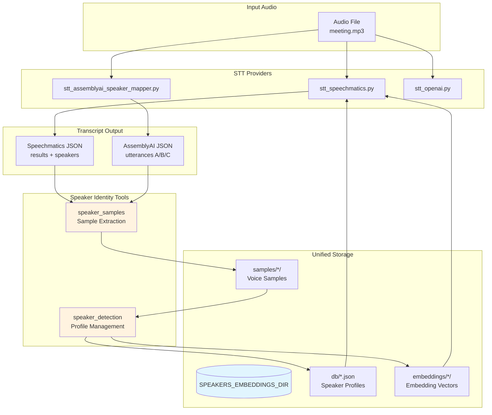
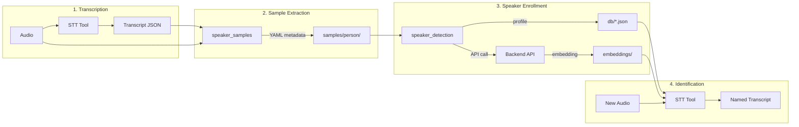
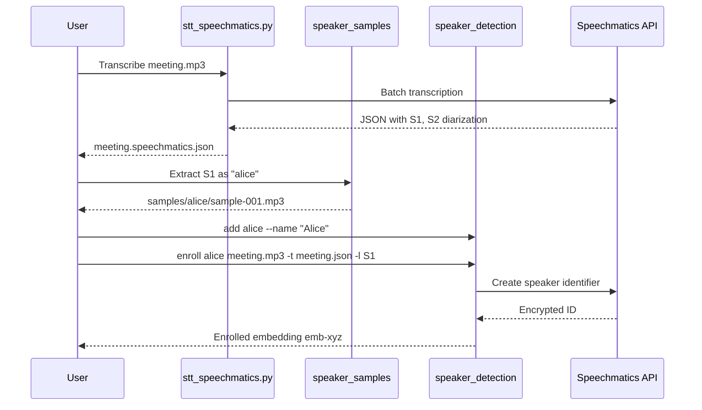
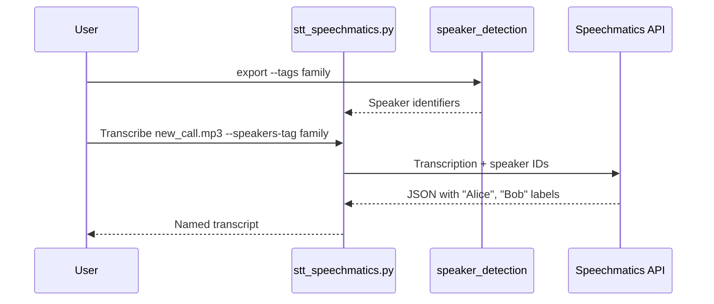
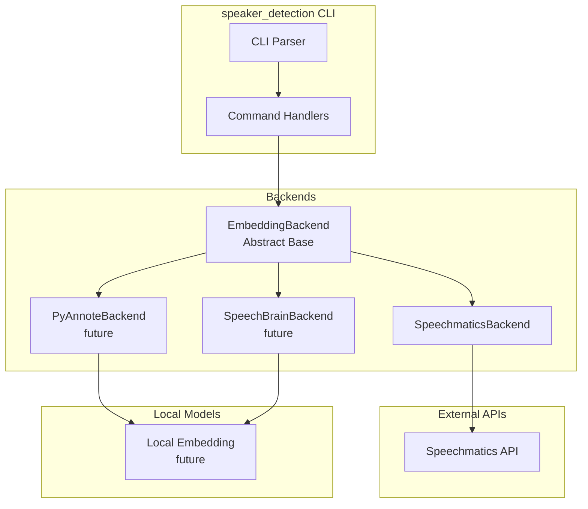
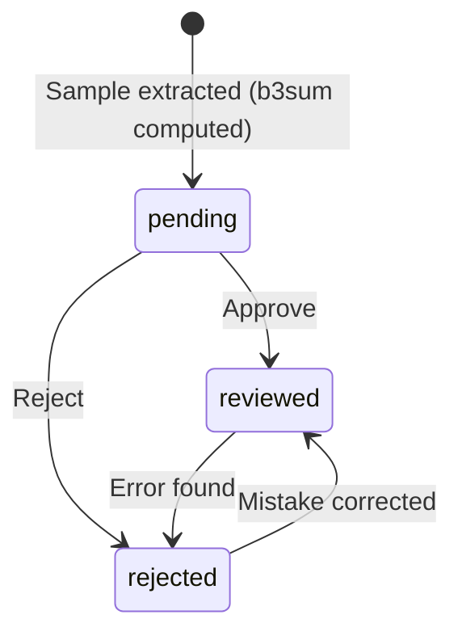

# Speaker Identity System Architecture

This document describes the unified speaker identity ecosystem in `handy_scripts_CLIAI` - a collection of tools for speech-to-text transcription with speaker identification capabilities.

## System Overview



## Data Flow



## Component Responsibilities

### Speech-to-Text Tools

| Tool | Provider | Diarization | Speaker ID | Output Format |
|------|----------|-------------|------------|---------------|
| `stt_speechmatics.py` | Speechmatics | S1, S2... | Yes | JSON (results) |
| `stt_assemblyai_speaker_mapper.py` | AssemblyAI | A, B, C... | LLM-based | JSON (utterances) |
| `stt_openai.py` | OpenAI | No | No | Text |

### Speaker Identity Tools

| Tool | Purpose | Input | Output |
|------|---------|-------|--------|
| `speaker_samples` | Voice sample extraction | Audio + Transcript | MP3 + YAML metadata |
| `speaker_detection` | Profile & embedding mgmt | Audio/Samples | JSON profiles, API embeddings |

## Storage Layout

```
$SPEAKERS_EMBEDDINGS_DIR/           # Default: ~/.config/speakers_embeddings
├── config.json                     # Global settings
├── db/                             # Speaker profiles
│   ├── alice.json                  # {id, names, tags, embeddings}
│   ├── bob.json
│   └── ...
├── embeddings/                     # Embedding vectors (local backends)
│   ├── alice/
│   │   └── emb-abc123.npy
│   └── ...
└── samples/                        # Voice samples (speaker_samples)
    ├── alice/
    │   ├── sample-001.mp3
    │   ├── sample-001.meta.yaml    # Provenance metadata
    │   ├── sample-002.mp3
    │   └── sample-002.meta.yaml
    └── bob/
        └── ...
```

## Speaker Profile Schema

```json
{
  "id": "alice",
  "version": 1,
  "names": {
    "default": "Alice Smith",
    "family": "Mom",
    "business": "Dr. Alice Smith"
  },
  "nicknames": ["Ali"],
  "tags": ["family", "primary"],
  "description": "Mother, software engineer",
  "metadata": {
    "email": "alice@example.com"
  },
  "embeddings": {
    "speechmatics": [
      {
        "id": "emb-abc123",
        "external_id": "spk_xyz...",
        "source_audio": "/path/to/audio.mp3",
        "created_at": "2026-01-12T..."
      }
    ]
  },
  "created_at": "2026-01-12T...",
  "updated_at": "2026-01-12T..."
}
```

## Sample Metadata Schema

```yaml
version: 2
sample_id: sample-001
b3sum: abc123def456...                 # Blake3 hash of THIS sample audio

source:
  audio_file: /path/to/meeting.mp3
  audio_b3sum: xyz789...               # Blake3 of source recording
  transcript_file: /path/to/meeting.speechmatics.json

segment:
  speaker_label: S1
  start_sec: 10.5
  end_sec: 25.3
  duration_sec: 14.8
  text: "transcribed speech content..."

extraction:
  tool: speaker_samples
  tool_version: 1.1.0
  extracted_at: 2026-01-12T10:30:00Z

review:
  status: pending                      # pending | reviewed | rejected
  reviewed_at: null
  notes: null
```

## Typical Workflows

### Initial Speaker Enrollment



### Speaker Identification in New Recording



## Backend Architecture



## Transcript Format Comparison

### Speechmatics (results array, seconds)

```json
{
  "results": [
    {
      "type": "word",
      "start_time": 0.04,
      "end_time": 0.32,
      "speaker": "S1",
      "alternatives": [{"content": "Hello", "speaker": "Alice"}]
    }
  ],
  "speakers": [
    {
      "label": "S1",
      "speaker_identifiers": ["spk_..."]
    }
  ]
}
```

### AssemblyAI (utterances array, milliseconds)

```json
{
  "utterances": [
    {
      "speaker": "A",
      "start": 40,
      "end": 320,
      "text": "Hello, how are you?"
    }
  ]
}
```

## Design Principles

1. **UNIX Philosophy**: Each tool does one thing well. Composable via pipes and files.

2. **Unified Storage**: Single `$SPEAKERS_EMBEDDINGS_DIR` namespace for all speaker data.

3. **Provenance Tracking**: Full metadata for reproducibility (audio hash, timestamps, source files).

4. **Backend Agnostic**: Abstract interface supports multiple embedding providers.

5. **Context-Aware Names**: Same person can have different display names per context (family vs business).

6. **jq-Compatible**: JSON storage enables ad-hoc queries via standard tooling.

## Tool Quick Reference

```bash
# Speaker profile management
./speaker_detection add <id> --name "Name" [--tag tag]
./speaker_detection list [--tags tag] [--format json]
./speaker_detection show <id>
./speaker_detection update <id> [--name "New Name"]
./speaker_detection delete <id> [--force]

# Speaker enrollment
./speaker_detection enroll <id> <audio> [--from-transcript file.json --speaker-label S1]
./speaker_detection embeddings <id>
./speaker_detection identify <audio> [--tags tags]
./speaker_detection verify <id> <audio>

# Sample extraction
./speaker_samples extract <audio> -t transcript.json -l S1 -s speaker_id
./speaker_samples segments -t transcript.json -l S1  # JSONL output
./speaker_samples list [speaker_id]
./speaker_samples info <speaker_id> <sample_id>
./speaker_samples remove <speaker_id> [--all]

# STT with speaker identification
./stt_speechmatics.py <audio> --speakers-tag <tag> [--speaker-id id1,id2]

# Review workflow
./speaker_samples review <speaker_id> <sample_id> --approve|--reject [--notes "..."]
./speaker_samples list <speaker_id> --show-review --status pending|reviewed|rejected

# Trust level verification
./speaker_detection embeddings <id> --show-trust
./speaker_detection check-validity [speaker_id]
```

## Review State and Trust Levels

Diarization produces many samples from recordings. Users may not review all samples immediately but want to use them for embeddings. The review/trust system tracks sample quality.

### Sample Review States



Each sample has a review status stored in its `.meta.yaml`:

```yaml
review:
  status: pending | reviewed | rejected
  reviewed_at: 2026-01-15T10:30:00Z
  notes: "confirmed correct speaker"
```

### Content-Addressable Tracking with Blake3

Samples are identified by their blake3 hash (`b3sum`). This enables:

* **Content verification** - detect if audio was modified
* **Provenance tracking** - link embeddings to exact source samples
* **Trust computation** - aggregate sample states into embedding confidence

### Trust Level Hierarchy

Embeddings store which samples (by b3sum) were used during enrollment:

```json
{
  "id": "emb-abc12345",
  "samples": {
    "reviewed": ["abc123...", "def456..."],
    "unreviewed": ["789xyz..."],
    "rejected": []
  },
  "trust_level": "medium"
}
```

Trust levels computed from sample lists:

| Level | Criteria | Use Case |
|-------|----------|----------|
| **HIGH** | All samples reviewed, none rejected | Critical identification |
| **MEDIUM** | Mix of reviewed + unreviewed, none rejected | General use |
| **LOW** | All samples unreviewed | Exploration only |
| **INVALIDATED** | Any sample rejected | Needs re-enrollment |

### Invalidation Detection

When samples are later rejected, embeddings become invalid:

```bash
# Check all embeddings against current sample states
./speaker_detection check-validity

# Sample output:
# INVALIDATED: alice/speechmatics/emb-abc12345
#   Newly rejected samples: abc123...
#
# Checked 5 embeddings across 2 speakers
#   1 INVALIDATED (re-enrollment needed)
```

This enables continuous quality improvement: review samples as time permits, then re-enroll speakers whose embeddings are now suspect.

## See Also

* [CONTRIBUTING.md](../CONTRIBUTING.md) - Coding guidelines and UNIX philosophy
* [speaker_detection.README.md](../speaker_detection.README.md)
* [speaker_samples.README.md](../speaker_samples.README.md)
* [stt_speechmatics.README.md](../stt_speechmatics.README.md)
* [evals/speaker_detection/](../evals/speaker_detection/) - Test suite
